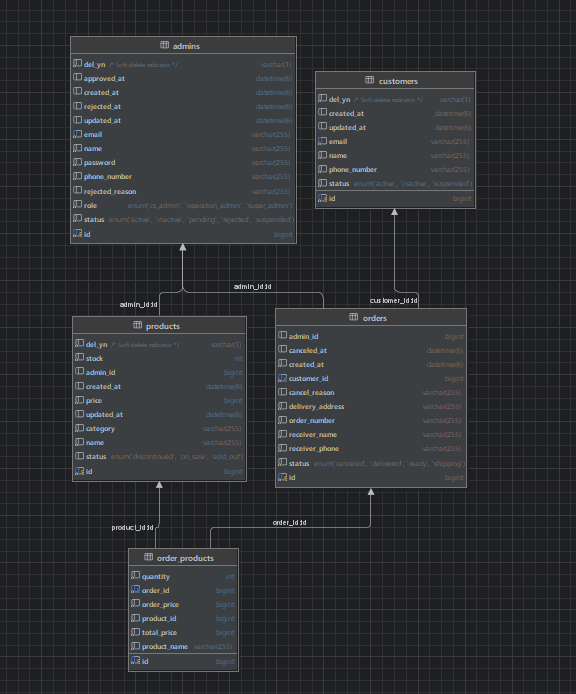

# 🛒 E-Commerce Backoffice REST API

> **실제 쇼핑몰의 운영 흐름을 반영한 이커머스 백오피스 통합 관리 REST API 시스템**
>
>
> 개발 기간: 2026.04.24 ~ 2026.04.30 (7일)
>

## 1. 프로젝트 개요

우리는 이커머스 백오피스의 운영 업무를 4개 핵심 도메인(관리자, 고객, 상품, 주문)과 **31개의 API**로 구조화했습니다. 단순 CRUD를 넘어 계정 승인, 세션 인증, 재고 처리, 주문 상태 전이 등 실제 백엔드 운영 정책을 안전하게 처리하는 데 집중했습니다. 특화 포인트 (Key Features)

- **비즈니스 로직 중심 설계:** 단순 데이터 조작(CRUD)이 아닌 실제 비즈니스 흐름을 고려한 아키텍처
- **다중 상품 주문 (OrderProduct):** 장바구니 및 복수 상품 주문 흐름을 반영한 구조 설계
- **주문 스냅샷 (Snapshot):** 주문 시점의 상품 정보(가격, 이름)를 별도 저장하여 데이터 정합성 유지
- **소프트 딜리트 (Soft Delete):** 삭제 상태값 관리(`status` 변경)를 통해 운영 이력 및 정산 데이터 영구 보존
- **독립적인 도메인 API:** 상태 변경, 재고 변경 등 성격이 다른 기능을 개별 API로 분리하여 책임 명확화 및 확장성 확보

## 2. 팀원 구성 및 역할

| 이름 | 역할 | 도메인 및 개발 담당 | 프로젝트 관리 담당 |
| --- | --- | --- | --- |
| **양지원** | 팀장 | 관리자, 세션, 전역예외, 공통응답 | 전체 총괄, GitHub 관리, 발표자료 제작/발표 |
| **한예진** | 팀원 | 고객, 페이지네이션, 공통응답 | 시연 영상 제작 |
| **김인안** | 팀원 | 로그인, 세션, 페이지네이션 | 회의록 작성, 튜터 피드백 정리 |
| **김민성** | 팀원 | 주문 | 발표 자료 제작 |
| **라예실** | 팀원 | 상품 | 발표 리허설 주도 및 트러블슈팅 정리 |

## 3. 기술 스택 및 아키텍처

우리는 도메인별 계층 구조를 명확히 하고, 공통 응답과 예외 처리, 세션 인증을 적용하여 API 응답과 접근 제어를 일관되게 관리했습니다.

| 기술 요소 | 활용 목적 및 구현 결과 |
| --- | --- |
| **Spring Boot** | REST API 서버 구축. `Controller`-`Service`-`Repository` 계층형 아키텍처 적용 |
| **Spring Data JPA** | 도메인(관리자, 상품, 주문, 고객) 엔티티 관리 및 핵심 CRUD 효율화 |
| **JPQL** | 고객 검색, 상태 필터링, 고객별 주문 수/총 구매 금액 등 복잡한 집계 및 필터링 구현 |
| **Session & Interceptor** | 관리자 권한 인증. 로그인한 관리자만 API에 접근하도록 전역 검증 흐름(Interceptor) 적용 |
| **CommonResponse** | 프론트엔드와의 협업을 위한 일관된 성공/실패 JSON 응답 규격 통일 |
| **GlobalExceptionHandler** | 비즈니스 예외(고객 없음, 재고 부족 등)를 가로채어 규격화된 상태코드와 메시지로 반환 |
| **Pageable** | 고객, 상품, 관리자 목록 조회 시 페이징 처리 지원 (PageResponse DTO 활용) |
| **Enum** | 상태값(승인대기/활성, 배송중/완료 등) 하드코딩 방지 및 타입 안정성 보장 |

## 4. 핵심 비즈니스 정책 (Domain Policy)

각 도메인은 독립적인 규칙을 가지며, 이를 서버 로직으로 꼼꼼하게 통제합니다.

### Admin (관리자)

- **가입 및 계정:** 사내 지급 이메일만 가입 가능 (개인 메일 차단). 탈퇴한 이메일은 재가입 불가.
- **인증 및 인가:** **활성(ACTIVE)** 상태의 관리자만 로그인 가능. (승인대기, 정지 계정 차단)
- **상태 관리:** 승인대기 상태는 임의 변경 불가, 오직 '승인/거부' 액션을 통해서만 전환됨.
- **보안:** 비밀번호 변경 시 현재 비밀번호 확인 필수.

### Customer (고객)

- **이력 보존:** 탈퇴 시 DB에서 `DELETE` 하지 않고 상태값을 '비활성'으로 전환하는 Soft Delete 적용.

### Product (상품)

- **무결성:** 상품명 중복 불가.
- **재고 자동화:** 주문 생성 시 재고 차감, 주문 취소 시 재고 자동 복구. 재고가 0이 되면 **품절(SOLD_OUT)** 상태로 자동 전환.
- **API 분리 설계:** 재고 수정과 상태 수정을 하나의 API로 합치지 않고 분리. (책임 분리 및 검증 로직 복잡도 완화)

### 🛒 Order (주문)

- **상태 전이 흐름:** `준비중` ➡ `배송중` ➡ `배송완료` 의 단방향 순서로만 변경 가능.
- **주문 취소:** `준비중` 상태에서만 취소 가능하며, 물리적 삭제가 아닌 `PATCH`를 통한 상태값 변경 처리.
- **데이터 정합성 (Snapshot):** 상품 가격이나 이름이 변경되어도, 과거 주문 내역에는 **주문 당시의 상품명과 가격**이 유지되도록 스냅샷 저장.

## 5. 프로젝트 수행 타임라인 (7 Days)

| 단계 | 기간 | 활동 내용 | 비고 |
| --- | --- | --- | --- |
| **사전 기획** | 4/24 | ERD 설계, API 명세 정의, 프로젝트 구조 및 코드 컨벤션 논의 | 초기 설계 |
| **개발 (1차)** | 4/25 ~ 4/26 | 4개 도메인 핵심 CRUD 구현, 로그인/세션, 전역 예외 처리 및 공통 응답 초기 세팅 | 핵심 기능 |
| **개발 (2차)** | 4/27 | 페이징/정렬 기준 구현, 공통 응답 개선, Postman API 통합 검증 | 기능 안정화 |
| **통합 및 협업** | 4/28 | 전역 예외 처리 및 공통 응답 구조 최종 통일, 브랜치 통합 | Merge Day |
| **리팩토링** | 4/29 ~ 4/30 | Response DTO `from()` 메서드 적용, 레이어별 책임 분리 재확인, 세션 상수화 | Refactoring |
| **마무리** | 4/30 | 디렉토리 구조 정리, 최종 테스트, 발표 자료 및 스크립트 작성 | 최종 보고 |

## 🗄 6. ERD (Entity Relationship Diagram)



## 7. API 명세서


## 공통 사항

- Base URL: `http://localhost:8080`
- 인증 방식: Session / Cookie 기반 인증
- 로그인 이후 인증이 필요한 API는 `JSESSIONID` 쿠키가 필요합니다.

```http
Content-Type: application/json
Cookie: JSESSIONID={sessionId}
```

## 공통 응답 형식

```json
{
  "status": 200,
  "message": "요청 성공 메시지",
  "data": {}
}
```

## 공통 에러 코드

| 상태 코드 | 설명 |
| --- | --- |
| 400 Bad Request | 잘못된 요청값, 필수값 누락, 유효성 검증 실패 |
| 401 Unauthorized | 로그인 필요 또는 인증 실패 |
| 403 Forbidden | 접근 권한 없음 |
| 404 Not Found | 존재하지 않는 리소스 |
| 409 Conflict | 중복 데이터 |

---

<details>
<summary><strong>Admin API</strong></summary>

# 관리자 API 명세

## 1. 로그인

- 기능분류: 관리자 인증
- API Path: `/auth/login`
- HTTP Method: `POST`

### 설명
이메일과 비밀번호로 로그인합니다.  
관리자 상태가 `ACTIVE`인 경우에만 로그인이 가능합니다.

### Request Body

```json
{
  "email": "test@test.com",
  "password": "12345678"
}
```

### Response

#### 200 OK

```json
{
  "status": 200,
  "message": "로그인 성공",
  "data": {
    "adminId": 1,
    "email": "test@test.com",
    "role": "CS_ADMIN"
  }
}
```

### 실패 응답

| 상태코드 | 설명 |
| --- | --- |
| 400 Bad Request | 요청값 형식 오류 |
| 401 Unauthorized | 이메일 또는 비밀번호 불일치 |
| 403 Forbidden | 계정 상태가 ACTIVE가 아님 |

---

## 2. 로그아웃

- 기능분류: 관리자 인증
- API Path: `/auth/logout`
- HTTP Method: `POST`

### 설명
로그인된 관리자의 세션을 무효화합니다.

### Request Body

없음

### Response

#### 200 OK

```json
{
  "status": 200,
  "message": "로그아웃 성공",
  "data": null
}
```

### 실패 응답

| 상태코드 | 설명 |
| --- | --- |
| 401 Unauthorized | 로그인 상태가 아님 |

---

## 3. 관리자 회원가입

- 기능분류: 관리자 관리
- API Path: `/admins/signup`
- HTTP Method: `POST`

### 설명
신규 관리자가 회원가입을 요청합니다.  
기본 상태는 `PENDING`입니다.

### Request Body

```json
{
  "name": "홍길동",
  "email": "test@test.com",
  "password": "12345678",
  "phone": "010-1234-5678",
  "role": "CS_ADMIN"
}
```

### Response

#### 201 Created

```json
{
  "status": 201,
  "message": "회원가입 성공. 관리자의 승인을 기다려주세요.",
  "data": {
    "adminId": 1,
    "name": "홍길동",
    "email": "test@test.com",
    "phone": "010-1234-5678",
    "role": "CS_ADMIN",
    "status": "PENDING",
    "createdAt": "2026-04-09T18:30:00+09:00"
  }
}
```

### 실패 응답

| 상태코드 | 설명 |
| --- | --- |
| 400 Bad Request | 요청값 형식 오류 또는 필수값 누락 |
| 409 Conflict | 중복 이메일 |

---

## 4. 관리자 리스트 조회

- 기능분류: 관리자 관리
- API Path: `/admins`
- HTTP Method: `GET`

### 설명
관리자 목록을 조회합니다.  
슈퍼 관리자만 접근할 수 있습니다.

### Query Parameters

| 이름 | 필수 | 설명 |
| --- | --- | --- |
| keyword | NO | 이름 또는 이메일 검색 |
| page | NO | 페이지 번호 |
| size | NO | 페이지당 개수 |
| sortBy | NO | 정렬 기준 |
| sortOrder | NO | 정렬 순서 |
| role | NO | 관리자 역할 |
| status | NO | 관리자 상태 |

### Response

#### 200 OK

```json
{
  "status": 200,
  "message": "관리자 리스트 조회 성공",
  "data": {
    "content": [
      {
        "adminId": 1,
        "name": "홍길동",
        "email": "test@test.com",
        "phone": "010-1234-5678",
        "role": "CS_ADMIN",
        "status": "ACTIVE",
        "createdAt": "2026-04-09T18:30:00+09:00",
        "approvedAt": "2026-04-10T18:30:00+09:00"
      }
    ],
    "page": 1,
    "size": 10,
    "totalElements": 1,
    "totalPages": 1
  }
}
```

### 실패 응답

| 상태코드 | 설명 |
| --- | --- |
| 401 Unauthorized | 로그인 필요 |
| 403 Forbidden | 권한 없음 |

---

## 5. 관리자 상세 조회

- 기능분류: 관리자 관리
- API Path: `/admins/{adminId}`
- HTTP Method: `GET`

### 설명
특정 관리자의 상세 정보를 조회합니다.  
슈퍼 관리자만 접근할 수 있습니다.

### Path Variable

| 이름 | 설명 |
| --- | --- |
| adminId | 관리자 고유 ID |

### Response

#### 200 OK

```json
{
  "status": 200,
  "message": "관리자 상세 조회 성공",
  "data": {
    "id": 1,
    "name": "홍길동",
    "email": "test@test.com",
    "phoneNumber": "010-1234-5678",
    "role": "CS 관리자",
    "status": "활성",
    "createdAt": "2026-04-09T18:30:00+09:00",
    "updatedAt": "2026-04-10T18:30:00+09:00",
    "approvedAt": "2026-04-10T18:30:00+09:00",
    "rejectedAt": null,
    "rejectedReason": null
  }
}
```

### 실패 응답

| 상태코드 | 설명 |
| --- | --- |
| 401 Unauthorized | 로그인 필요 |
| 403 Forbidden | 권한 없음 |
| 404 Not Found | 존재하지 않는 관리자 |

---

## 6. 관리자 정보 수정

- 기능분류: 관리자 관리
- API Path: `/admins/{adminId}`
- HTTP Method: `PATCH`

### 설명
관리자의 이름, 이메일, 전화번호를 수정합니다.  
슈퍼 관리자만 접근할 수 있습니다.

### Path Variable

| 이름 | 설명 |
| --- | --- |
| adminId | 관리자 고유 ID |

### Request Body

```json
{
  "name": "김코딩",
  "email": "super@test.com",
  "phoneNumber": "010-1111-1111"
}
```

### Response

#### 200 OK

```json
{
  "status": 200,
  "message": "관리자 정보 수정 성공",
  "data": {
    "id": 1,
    "name": "김코딩",
    "email": "super@test.com",
    "phoneNumber": "010-1111-1111",
    "role": "CS 관리자",
    "status": "활성",
    "updatedAt": "2026-04-10T18:30:00+09:00"
  }
}
```

### 실패 응답

| 상태코드 | 설명 |
| --- | --- |
| 400 Bad Request | 요청값 형식 오류 |
| 401 Unauthorized | 로그인 필요 |
| 403 Forbidden | 권한 없음 |
| 404 Not Found | 존재하지 않는 관리자 |
| 409 Conflict | 중복 이메일 |

---

## 7. 관리자 역할 변경

- 기능분류: 관리자 관리
- API Path: `/admins/{adminId}/role`
- HTTP Method: `PATCH`

### 설명
관리자의 역할을 변경합니다.  
슈퍼 관리자만 접근할 수 있습니다.

### Path Variable

| 이름 | 설명 |
| --- | --- |
| adminId | 관리자 고유 ID |

### Request Body

```json
{
  "role": "CS_ADMIN"
}
```

### Response

#### 200 OK

```json
{
  "status": 200,
  "message": "관리자 역할 변경 성공",
  "data": {
    "id": 1,
    "name": "홍길동",
    "email": "test@test.com",
    "role": "CS_ADMIN",
    "status": "ACTIVE",
    "updatedAt": "2026-04-10T18:30:00+09:00"
  }
}
```

### 실패 응답

| 상태코드 | 설명 |
| --- | --- |
| 400 Bad Request | 존재하지 않는 역할값 |
| 401 Unauthorized | 로그인 필요 |
| 403 Forbidden | 권한 없음 |
| 404 Not Found | 존재하지 않는 관리자 |

---

## 8. 관리자 상태 변경

- 기능분류: 관리자 관리
- API Path: `/admins/{adminId}/status`
- HTTP Method: `PATCH`

### 설명
관리자의 상태를 변경합니다.  
슈퍼 관리자만 접근할 수 있습니다.

### Path Variable

| 이름 | 설명 |
| --- | --- |
| adminId | 관리자 고유 ID |

### Request Body

```json
{
  "status": "INACTIVE"
}
```

### Response

#### 200 OK

```json
{
  "status": 200,
  "message": "관리자 상태 변경 성공",
  "data": {
    "id": 1,
    "name": "홍길동",
    "email": "test@test.com",
    "role": "CS_ADMIN",
    "status": "INACTIVE",
    "updatedAt": "2026-04-10T18:30:00+09:00"
  }
}
```

### 실패 응답

| 상태코드 | 설명 |
| --- | --- |
| 400 Bad Request | 존재하지 않는 상태값 |
| 401 Unauthorized | 로그인 필요 |
| 403 Forbidden | 권한 없음 |
| 404 Not Found | 존재하지 않는 관리자 |

---

## 9. 관리자 삭제

- 기능분류: 관리자 관리
- API Path: `/admins/{adminId}`
- HTTP Method: `DELETE`

### 설명
특정 관리자를 삭제합니다.  
슈퍼 관리자만 접근할 수 있습니다.

### Path Variable

| 이름 | 설명 |
| --- | --- |
| adminId | 관리자 고유 ID |

### Response

#### 200 OK

```json
{
  "status": 200,
  "message": "관리자 삭제 성공",
  "data": null
}
```

### 실패 응답

| 상태코드 | 설명 |
| --- | --- |
| 401 Unauthorized | 로그인 필요 |
| 403 Forbidden | 권한 없음 |
| 404 Not Found | 존재하지 않는 관리자 |

---

## 10. 관리자 등록 승인

- 기능분류: 관리자 관리
- API Path: `/admins/{adminId}/approve`
- HTTP Method: `POST`

### 설명
`PENDING` 상태의 관리자를 `ACTIVE` 상태로 변경합니다.  
슈퍼 관리자만 접근할 수 있습니다.

### Path Variable

| 이름 | 설명 |
| --- | --- |
| adminId | 관리자 고유 ID |

### Request Body

없음

### Response

#### 200 OK

```json
{
  "status": 200,
  "message": "관리자 등록 승인 성공",
  "data": {
    "adminId": 2,
    "name": "김코딩",
    "email": "kim123@test.com",
    "phoneNumber": "010-0000-0000",
    "role": "CS_ADMIN",
    "status": "ACTIVE",
    "approvedAt": "2026-04-10T18:30:00+09:00"
  }
}
```

### 실패 응답

| 상태코드 | 설명 |
| --- | --- |
| 400 Bad Request | 승인대기 상태가 아님 |
| 401 Unauthorized | 로그인 필요 |
| 403 Forbidden | 권한 없음 |
| 404 Not Found | 존재하지 않는 관리자 |

---

## 11. 관리자 등록 거부

- 기능분류: 관리자 관리
- API Path: `/admins/{adminId}/reject`
- HTTP Method: `POST`

### 설명
`PENDING` 상태의 관리자를 `REJECTED` 상태로 변경합니다.  
슈퍼 관리자만 접근할 수 있습니다.

### Path Variable

| 이름 | 설명 |
| --- | --- |
| adminId | 관리자 고유 ID |

### Request Body

```json
{
  "rejectedReason": "거부 사유"
}
```

### Response

#### 200 OK

```json
{
  "status": 200,
  "message": "관리자 등록 거부 성공",
  "data": {
    "adminId": 2,
    "name": "김코딩",
    "email": "kim123@test.com",
    "phoneNumber": "010-0000-0000",
    "role": "CS_ADMIN",
    "status": "REJECTED",
    "rejectedAt": "2026-04-10T18:30:00+09:00",
    "rejectedReason": "거부 사유"
  }
}
```

### 실패 응답

| 상태코드 | 설명 |
| --- | --- |
| 400 Bad Request | 승인대기 상태가 아님 |
| 401 Unauthorized | 로그인 필요 |
| 403 Forbidden | 권한 없음 |
| 404 Not Found | 존재하지 않는 관리자 |

---

## 12. 내 프로필 조회

- 기능분류: 관리자 관리
- API Path: `/admins/profile`
- HTTP Method: `GET`

### 설명
로그인한 관리자의 프로필을 조회합니다.

### Response

#### 200 OK

```json
{
  "status": 200,
  "message": "내 프로필 조회 성공",
  "data": {
    "id": 1,
    "name": "홍길동",
    "email": "test@test.com",
    "phoneNumber": "010-1234-5678",
    "role": "CS 관리자",
    "status": "활성"
  }
}
```

### 실패 응답

| 상태코드 | 설명 |
| --- | --- |
| 401 Unauthorized | 로그인 필요 |
| 404 Not Found | 존재하지 않는 관리자 |

---

## 13. 내 프로필 수정

- 기능분류: 관리자 관리
- API Path: `/admins/profile`
- HTTP Method: `PATCH`

### 설명
로그인한 관리자의 프로필 정보를 수정합니다.

### Request Body

```json
{
  "name": "변경된 이름",
  "email": "hong01011@gmail.com",
  "phoneNumber": "010-0000-0000"
}
```

### Response

#### 200 OK

```json
{
  "status": 200,
  "message": "내 프로필 수정 성공",
  "data": {
    "adminId": 3,
    "name": "변경된 이름",
    "email": "test123@test.com",
    "phoneNumber": "010-0000-0000",
    "role": "CS 관리자",
    "status": "활성"
  }
}
```

### 실패 응답

| 상태코드 | 설명 |
| --- | --- |
| 400 Bad Request | 요청값 형식 오류 |
| 401 Unauthorized | 로그인 필요 |
| 404 Not Found | 존재하지 않는 관리자 |
| 409 Conflict | 중복 이메일 |

---

## 14. 내 비밀번호 변경

- 기능분류: 관리자 관리
- API Path: `/admins/profile/password`
- HTTP Method: `PATCH`

### 설명
로그인한 관리자의 비밀번호를 변경합니다.

### Request Body

```json
{
  "currentPassword": "01234567",
  "newPassword": "12345678",
  "confirmPassword": "12345678"
}
```

### Response

#### 200 OK

```json
{
  "status": 200,
  "message": "비밀번호 변경 성공",
  "data": null
}
```

### 실패 응답

| 상태코드 | 설명 |
| --- | --- |
| 400 Bad Request | 현재 비밀번호 불일치 |
| 400 Bad Request | 새 비밀번호와 확인 비밀번호 불일치 |
| 400 Bad Request | 비밀번호 형식 불일치 |
| 401 Unauthorized | 로그인 필요 |
| 404 Not Found | 존재하지 않는 관리자 |
</details>

---

<details>
<summary><strong>Customer API</strong></summary>

# 고객 API 명세

## 1. 고객 리스트 조회

- 기능분류: 고객 관리
- API Path: `/customers`
- HTTP Method: `GET`

### 설명
로그인한 관리자가 고객 목록을 조회합니다.

### Query Parameters

| 이름 | 필수 | 설명 |
| --- | --- | --- |
| keyword | NO | 이름 또는 이메일 검색 |
| page | NO | 페이지 번호 |
| size | NO | 페이지당 개수 |
| sortBy | NO | 정렬 기준 |
| sortOrder | NO | 정렬 순서 |
| status | NO | 고객 상태 필터 |

### Response

#### 200 OK

```json
{
  "status": 200,
  "message": "고객 리스트 조회 성공",
  "data": {
    "content": [
      {
        "customerId": 1,
        "name": "고객1",
        "email": "customer1@test.com",
        "phoneNumber": "010-1234-0001",
        "status": "활성",
        "createdAt": "2026-04-28T22:07:55.295309",
        "updatedAt": "2026-04-28T22:07:55.295309"
      }
    ],
    "page": 1,
    "size": 10,
    "totalElements": 1,
    "totalPages": 1
  }
}
```

### 실패 응답

| 상태코드 | 설명 |
| --- | --- |
| 401 Unauthorized | 로그인 필요 |

---

## 2. 고객 상세 조회

- 기능분류: 고객 관리
- API Path: `/customers/{customerId}`
- HTTP Method: `GET`

### 설명
특정 고객의 상세 정보를 조회합니다.

### Path Variable

| 이름 | 설명 |
| --- | --- |
| customerId | 고객 고유 ID |

### Response

#### 200 OK

```json
{
  "status": 200,
  "message": "고객 상세 조회 성공",
  "data": {
    "customerId": 1,
    "name": "고객1",
    "email": "customer1@test.com",
    "phoneNumber": "010-1234-0001",
    "status": "활성",
    "createdAt": "2026-04-28T22:12:53.488035",
    "updatedAt": "2026-04-28T22:12:53.488035"
  }
}
```

### 실패 응답

| 상태코드 | 설명 |
| --- | --- |
| 401 Unauthorized | 로그인 필요 |
| 404 Not Found | 존재하지 않는 고객 |

---

## 3. 고객 정보 수정

- 기능분류: 고객 관리
- API Path: `/customers/{customerId}`
- HTTP Method: `PATCH`

### 설명
고객의 이름, 이메일, 전화번호를 수정합니다.

### Path Variable

| 이름 | 설명 |
| --- | --- |
| customerId | 고객 고유 ID |

### Request Body

```json
{
  "name": "홍길동",
  "email": "new_email@example.com",
  "phoneNumber": "010-1111-2222"
}
```

### Response

#### 200 OK

```json
{
  "status": 200,
  "message": "고객 정보 수정 성공",
  "data": {
    "customerId": 1,
    "name": "홍길동",
    "email": "new_email@test.com",
    "phoneNumber": "010-1111-2222",
    "status": "활성",
    "createdAt": "2026-04-09T18:30:00+09:00",
    "updatedAt": "2024-03-05T11:00:00"
  }
}
```

### 실패 응답

| 상태코드 | 설명 |
| --- | --- |
| 400 Bad Request | 잘못된 요청값 |
| 401 Unauthorized | 로그인 필요 |
| 404 Not Found | 존재하지 않는 고객 |
| 409 Conflict | 이메일 중복 |

---

## 4. 고객 상태 변경

- 기능분류: 고객 관리
- API Path: `/customers/{customerId}/status`
- HTTP Method: `PATCH`

### 설명
고객 상태를 변경합니다.

### Path Variable

| 이름 | 설명 |
| --- | --- |
| customerId | 고객 고유 ID |

### Request Body

```json
{
  "status": "SUSPENDED"
}
```

### Response

#### 200 OK

```json
{
  "status": 200,
  "message": "고객 상태 변경 성공",
  "data": {
    "customerId": 1,
    "status": "정지",
    "updatedAt": "2026-04-24T17:30:00+09:00"
  }
}
```

### 실패 응답

| 상태코드 | 설명 |
| --- | --- |
| 401 Unauthorized | 로그인 필요 |
| 403 Forbidden | 접근 권한 없음 |
| 404 Not Found | 존재하지 않는 고객 |

---

## 5. 고객 삭제

- 기능분류: 고객 관리
- API Path: `/customers/{customerId}`
- HTTP Method: `DELETE`

### 설명
특정 고객을 삭제합니다.

### Path Variable

| 이름 | 설명 |
| --- | --- |
| customerId | 고객 고유 ID |

### Request Body

없음

### Response

#### 200 OK

```json
{
  "status": 200,
  "message": "고객 삭제 성공",
  "data": null
}
```

### 실패 응답

| 상태코드 | 설명 |
| --- | --- |
| 401 Unauthorized | 로그인 필요 |
| 403 Forbidden | 접근 권한 없음 |
| 404 Not Found | 존재하지 않는 고객 |

</details>

---

<details>
<summary><strong>Product API</strong></summary>

<br>

# 상품 API 명세

## 1. 상품 등록

- 기능분류: 상품 정보 관리
- API Path: `/products`
- HTTP Method: `POST`

### 설명
관리자가 상품을 등록합니다.  
기본 상품 상태는 `ON_SALE`입니다.

### Request Body

```json
{
  "name": "상품 이름",
  "category": "카테고리",
  "price": 10000,
  "stock": 10,
  "status": "ON_SALE"
}
```

### Response

#### 201 Created

```json
{
  "status": 201,
  "message": "상품 등록 성공",
  "data": {
    "productId": 1,
    "name": "상품 이름",
    "category": "카테고리",
    "price": 10000,
    "stock": 10,
    "status": "판매중",
    "createdAt": "2026-04-09T18:30:00+09:00"
  }
}
```

### 실패 응답

| 상태코드 | 설명 |
| --- | --- |
| 400 Bad Request | 필수값 누락 |
| 401 Unauthorized | 로그인 필요 |
| 409 Conflict | 중복 상품 |

---

## 2. 상품 리스트 조회

- 기능분류: 상품 정보 관리
- API Path: `/products`
- HTTP Method: `GET`

### 설명
상품 목록을 조회합니다.

### Query Parameters

| 이름 | 필수 | 설명 |
| --- | --- | --- |
| keyword | NO | 상품 이름 검색 |
| page | NO | 페이지 번호 |
| size | NO | 페이지당 개수 |
| sortBy | NO | 정렬 기준 |
| sortOrder | NO | 정렬 순서 |
| category | NO | 카테고리 필터 |
| status | NO | 상품 상태 필터 |

### Response

#### 200 OK

```json
{
  "status": 200,
  "message": "상품 리스트 조회 성공",
  "data": {
    "content": [
      {
        "productId": 1,
        "name": "상품 이름",
        "category": "카테고리",
        "price": 10000,
        "stock": 10,
        "status": "판매중",
        "createdAt": "2026-04-09T18:30:00+09:00",
        "adminName": "관리자 이름"
      }
    ],
    "page": 1,
    "size": 10,
    "totalElements": 1,
    "totalPages": 1
  }
}
```

### 실패 응답

| 상태코드 | 설명 |
| --- | --- |
| 401 Unauthorized | 로그인 필요 |

---

## 3. 상품 상세 조회

- 기능분류: 상품 정보 관리
- API Path: `/products/{productId}`
- HTTP Method: `GET`

### 설명
특정 상품의 상세 정보를 조회합니다.

### Path Variable

| 이름 | 설명 |
| --- | --- |
| productId | 상품 고유 ID |

### Response

#### 200 OK

```json
{
  "status": 200,
  "message": "상품 상세 조회 성공",
  "data": {
    "productId": 1,
    "name": "상품 이름",
    "category": "카테고리",
    "price": 10000,
    "stock": 10,
    "status": "판매중",
    "createdAt": "2026-04-09T18:30:00+09:00",
    "adminName": "관리자 이름",
    "adminEmail": "test@test.com"
  }
}
```

### 실패 응답

| 상태코드 | 설명 |
| --- | --- |
| 401 Unauthorized | 로그인 필요 |
| 404 Not Found | 존재하지 않는 상품 |

---

## 4. 상품 정보 수정

- 기능분류: 상품 정보 관리
- API Path: `/products/{productId}`
- HTTP Method: `PATCH`

### 설명
상품명, 카테고리, 가격을 수정합니다.

### Path Variable

| 이름 | 설명 |
| --- | --- |
| productId | 상품 고유 ID |

### Request Body

```json
{
  "name": "변경된 상품 이름",
  "category": "변경된 카테고리",
  "price": 20000
}
```

### Response

#### 200 OK

```json
{
  "status": 200,
  "message": "상품 정보 수정 성공",
  "data": {
    "productId": 1,
    "name": "변경된 상품 이름",
    "category": "변경된 카테고리",
    "price": 20000,
    "stock": 10,
    "status": "판매중",
    "updatedAt": "2026-04-09T18:30:00+09:00"
  }
}
```

### 실패 응답

| 상태코드 | 설명 |
| --- | --- |
| 401 Unauthorized | 로그인 필요 |
| 404 Not Found | 존재하지 않는 상품 |

---

## 5. 상품 재고 변경

- 기능분류: 상품 정보 관리
- API Path: `/products/{productId}/stock`
- HTTP Method: `PATCH`

### 설명
상품 재고를 변경합니다.

### Path Variable

| 이름 | 설명 |
| --- | --- |
| productId | 상품 고유 ID |

### Request Body

```json
{
  "stock": 15
}
```

### Response

#### 200 OK

```json
{
  "status": 200,
  "message": "상품 재고 변경 성공",
  "data": {
    "productId": 1,
    "name": "상품 이름",
    "category": "카테고리",
    "price": 10000,
    "stock": 15,
    "status": "판매중",
    "updatedAt": "2026-04-11T18:30:00+09:00"
  }
}
```

### 실패 응답

| 상태코드 | 설명 |
| --- | --- |
| 401 Unauthorized | 로그인 필요 |
| 404 Not Found | 존재하지 않는 상품 |

---

## 6. 상품 상태 변경

- 기능분류: 상품 정보 관리
- API Path: `/products/{productId}/status`
- HTTP Method: `PATCH`

### 설명
상품 상태를 변경합니다.

### Path Variable

| 이름 | 설명 |
| --- | --- |
| productId | 상품 고유 ID |

### Request Body

```json
{
  "status": "DISCONTINUED"
}
```

### Response

#### 200 OK

```json
{
  "status": 200,
  "message": "상품 상태 변경 성공",
  "data": {
    "productId": 1,
    "name": "상품 이름",
    "category": "카테고리",
    "price": 10000,
    "stock": 15,
    "status": "단종",
    "updatedAt": "2026-04-11T18:30:00+09:00"
  }
}
```

### 실패 응답

| 상태코드 | 설명 |
| --- | --- |
| 401 Unauthorized | 로그인 필요 |
| 404 Not Found | 존재하지 않는 상품 |

---

## 7. 상품 삭제

- 기능분류: 상품 정보 관리
- API Path: `/products/{productId}`
- HTTP Method: `DELETE`

### 설명
특정 상품을 삭제합니다.

### Path Variable

| 이름 | 설명 |
| --- | --- |
| productId | 상품 고유 ID |

### Request Body

없음

### Response

#### 200 OK

```json
{
  "status": 200,
  "message": "상품 삭제 성공",
  "data": null
}
```

### 실패 응답

| 상태코드 | 설명 |
| --- | --- |
| 401 Unauthorized | 로그인 필요 |
| 404 Not Found | 존재하지 않는 상품 |

</details>


---


<details>
<summary><strong>Order API</strong></summary>

<br>

# 주문 API 명세

## 1. 주문 생성

- 기능분류: 주문 정보 관리
- API Path: `/orders`
- HTTP Method: `POST`

### 설명
CS 관리자가 고객 대신 주문을 생성합니다.  
로그인이 필요합니다.

### Request Body

```json
{
  "customerId": 1,
  "productId": 8,
  "quantity": 1,
  "receiverName": "고객60",
  "receiverPhone": "010-4111-1111",
  "deliveryAddress": "서울 어딘가"
}
```

### Response

#### 201 Created

```json
{
  "status": 201,
  "message": "주문 생성 성공",
  "data": {
    "id": 1,
    "createdAt": "2026-04-25T15:30:00",
    "orderNumber": "1-20260425",
    "status": "준비중",
    "quantity": 1,
    "orderPrice": 10000,
    "totalPrice": 10000,
    "adminId": 1
  }
}
```

### 실패 응답

| 상태코드 | 설명 |
| --- | --- |
| 400 Bad Request | 필수값 누락 또는 주문 불가 |
| 401 Unauthorized | 로그인 필요 |
| 404 Not Found | 존재하지 않는 고객/상품 |

---

## 2. 주문 리스트 조회

- 기능분류: 주문 정보 관리
- API Path: `/orders`
- HTTP Method: `GET`

### 설명
주문 목록을 페이지 단위로 조회합니다.  
로그인이 필요합니다.

### Query Parameters

| 이름 | 필수 | 설명 |
| --- | --- | --- |
| keyword | NO | 주문번호 또는 고객명 검색 |
| page | NO | 페이지 번호 |
| size | NO | 페이지당 개수 |
| sortBy | NO | 정렬 기준 |
| sortOrder | NO | 정렬 순서 |
| status | NO | 주문 상태 필터 |

### Response

#### 200 OK

```json
{
  "content": [
    {
      "id": 10,
      "orderNumber": "10-20260427",
      "customerName": "고객10",
      "productName": "상품10",
      "quantity": 2,
      "totalPrice": 200000,
      "createdAt": "2026-04-27T18:57:28.314031",
      "status": "준비중",
      "adminName": "관리자1"
    }
  ],
  "currentPage": 1,
  "size": 10,
  "totalElements": 10,
  "totalPages": 1
}
```

### 실패 응답

| 상태코드 | 설명 |
| --- | --- |
| 400 Bad Request | 잘못된 요청값 |
| 401 Unauthorized | 로그인 필요 |

---

## 3. 주문 상세 조회

- 기능분류: 주문 정보 관리
- API Path: `/orders/{orderId}`
- HTTP Method: `GET`

### 설명
특정 주문의 상세 정보를 조회합니다.  
CS 주문의 경우 관리자 정보도 함께 조회합니다.

### Path Variable

| 이름 | 설명 |
| --- | --- |
| orderId | 주문 ID |

### Response

#### 200 OK

```json
{
  "orderNumber": "2-20260427",
  "customerName": "고객2",
  "customerEmail": "customer2@test.com",
  "products": [
    {
      "productName": "상품2",
      "quantity": 3,
      "orderPrice": 20000,
      "totalPrice": 60000
    }
  ],
  "receiverName": "수령인2",
  "receiverPhone": "010-5000-0002",
  "deliveryAddress": "서울시 테스트구 테스트로 2",
  "createdAt": "2026-04-27T18:51:58.400199",
  "status": "준비중",
  "adminName": "관리자1",
  "adminEmail": "admin1@test.com",
  "adminRole": "CS 관리자"
}
```

### 실패 응답

| 상태코드 | 설명 |
| --- | --- |
| 401 Unauthorized | 로그인 필요 |
| 404 Not Found | 존재하지 않는 주문 |

---

## 4. 주문 상태 변경

- 기능분류: 주문 정보 관리
- API Path: `/orders/{orderId}/status`
- HTTP Method: `PATCH`

### 설명
주문 상태를 변경합니다.  
상태는 `준비중 → 배송중 → 배송완료` 순서로만 변경할 수 있습니다.

### Path Variable

| 이름 | 설명 |
| --- | --- |
| orderId | 주문 ID |

### Request Body

```json
{
  "status": "SHIPPING"
}
```

### Response

#### 200 OK

```json
{
  "orderNumber": "2-20260427",
  "customerName": "고객2",
  "products": [
    {
      "productName": "상품2",
      "quantity": 3,
      "orderPrice": 20000,
      "totalPrice": 60000
    }
  ],
  "status": "배송중"
}
```

### 실패 응답

| 상태코드 | 설명 |
| --- | --- |
| 400 Bad Request | 주문 상태 변경 순서 오류 |
| 401 Unauthorized | 로그인 필요 |
| 404 Not Found | 존재하지 않는 주문 |

---

## 5. 주문 취소

- 기능분류: 주문 정보 관리
- API Path: `/orders/{orderId}/cancel`
- HTTP Method: `PATCH`

### 설명
특정 주문을 취소합니다.  
`준비중` 상태의 주문만 취소할 수 있습니다.

### Path Variable

| 이름 | 설명 |
| --- | --- |
| orderId | 주문 ID |

### Request Body

```json
{
  "cancelReason": "취소 사유"
}
```

### Response

#### 200 OK

```json
{
  "orderNumber": "1-20260427",
  "status": "취소됨",
  "cancelReason": "취소 사유",
  "canceledAt": "2026-04-27T19:31:26.9907496"
}
```

### 실패 응답

| 상태코드 | 설명 |
| --- | --- |
| 400 Bad Request | 취소 가능한 상태가 아님 |
| 401 Unauthorized | 로그인 필요 |
| 404 Not Found | 존재하지 않는 주문 |

</details>


<details>
<summary><strong>주요 Enum 값</strong></summary>

<br>

## 관리자 역할

| 값 | 설명 |
| --- | --- |
| SUPER_ADMIN | 슈퍼 관리자 |
| OPERATION_ADMIN | 운영 관리자 |
| CS_ADMIN | CS 관리자 |

## 관리자 상태

| 값 | 설명 |
| --- | --- |
| ACTIVE | 활성 |
| INACTIVE | 비활성 |
| SUSPEND | 정지 |
| PENDING | 승인대기 |
| REJECTED | 거부 |

## 고객 상태

| 값 | 설명 |
| --- | --- |
| ACTIVE | 활성 |
| INACTIVE | 비활성 |
| SUSPENDED | 정지 |

## 상품 상태

| 값 | 설명 |
| --- | --- |
| ON_SALE | 판매중 |
| SOLD_OUT | 품절 |
| DISCONTINUED | 단종 |

## 주문 상태

| 값 | 설명 |
| --- | --- |
| READY | 준비중 |
| SHIPPING | 배송중 |
| DELIVERED | 배송완료 |
| CANCELED | 취소됨 |

</details>